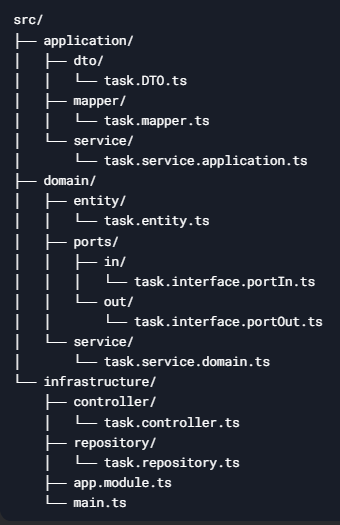

<p align="center">
  <a href="http://nestjs.com/" target="blank"></a>
</p>

# Hexagonal Architecture Template

This is a simple template for Hexagonal Architecture. It was designed using NestJs.

## Project Structure

The project follows the principles of Hexagonal Architecture, which separates the domain logic from the infrastructure and external dependencies. The key components are:

- **Application Layer**: This layer handles communication between the external world and the domain logic. It includes DTOs (Data Transfer Objects), mappers, and application services.
  
- **Domain Layer**: The core business logic of the application. This layer includes entities, service interfaces (ports), and implementation of domain services.

- **Infrastructure Layer**: This layer contains the implementation of the repositories, controllers, and external services, which interact with the domain layer through the defined interfaces (ports).

## Project Structure Overview




## Technologies Used

- **Nestjs

## Setup

1. Clone this repository:
    ```bash
    git clone https://github.com/your-repo/hexagonal-architecture-template.git](https://github.com/jadodev/template-hex-architecure
    ```

## Endpoints

You can interact with the application through REST API endpoints defined in the controller.

## Notes

This template follows the Hexagonal Architecture principles and includes basic setups for:
- Application services
- Domain services
- Infrastructure layer

Feel free to modify and extend this template to fit your project requirements.
